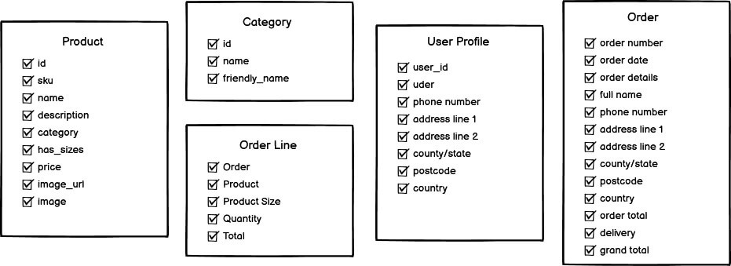

# Table of Contents

- [Description](#description)
- [UX](#ux)
- [User Stories](#user-stories)
- [Wireframes](#wireframes)
- [Database](#database)
- [Deployment](#deployment)
- [Features](#features)
- [Technologies and Tools Used](#technologies-and-tools-used)
- [Testing](#testing)
- [Credits](#credits)
- [Acknowledgements](#acknowledgements)

# Description
[Sports Zone](https://sports-zone-manny.herokuapp.com/) has been created to be a fictional e-commerce website. The main purpose of the website is to sell various sports products to individuals of all ages and sexualities. ‘Sports Zone’ specialises in two particular sports, football and cricket. The range of products is extremely diverse as the website sells items such as clothing to specialised equipment. 

# UX
The ‘Welcome page’ has been designed to make users easily aware of what type of products ‘Sports Zone’ distribute. To achieve this objective, a relevant background has been included to make it clear to all individuals what this website entails. Additionally, a ‘shop now’ button has been placed in the middle of the screen to establish an easily accessible way for the user to browse all products.
 
Brand awareness is a key feature for ‘Sports Zone’. To obtain this aspiration, the company logo has been placed in the same position throughout the website. This encourages the user to recognise the brand if ever seen elsewhere. 
 
A navigation bar and search bar has been placed on every page of the website. This has been created to provide a simple way for users to browse the website without any complications. Likewise, a shopping bag link and profile link has also been added to every page, to make it apparent to all users.

# User Stories
- ### As a Site User/Customer, I would like to:
    - Understand the range of products available for purchase.
    - Efficiently navigate through the site for browsing purposes.
    - Be able to have different categories to ease my way through the site
    - Be able to specifically search products I am interested in. 
    - View the products listed. 
    - Learn more about the product's specification in detail. 
    - Rearrange the products to have the ones I am interested in towards the top. 
    - View the items and the in shopping bag.
    - Update my basket without having to leave the shopping bag. 
    - View the individual and total cost of all products in the bag, including delivery cost. 
    - Securely checkout to purchase the items required. 
    - Have my details stored for future orders.
    - View the history of the products, I have purchased previously. 
    - Be able to log in and out of the site. 

- ### As an admin, I would like to:
    - Have access to add products with full details.
    - Have access to updated products where needed. 
    - Update images if required. 
    - Have access to remove products or users if needed. 

- ### To achieve the above targets, I have added:
    - A Landing Page and Logo determining the meaning and purpose of the site. 
    - A Navigation bar using bootstrap to guide the user through the site. 
    - Various categories so the user can be lead in the right direction efficiently.
    - A search bar for the user to explore a specific product in mind.
    - Products page, where the user can view all the project in a selected category.
    - Product detail page, where the user can find the product information. 
    - Select Menu for the user to select the order they would like to arrange the list in. 
    - Shopping bag, where the user can add products ready to be purchased. 
    - Cost section, where the user can view the total cost, sub-total for a specific product and delivery cost if required. 
    - Secure Checkout page, where the user can add their details securely to checkout and purchase the products. 
    - Profile page, where the details are saved for the user for future purchases.
    - Profile page, where the user can check their order history. 
    - Dropdown menu with options to log in if not already and log out once logged in. 
    - Added product management in the dropdown menu for admin to add new products. 
    - Added edit and remove buttons for the admin to update details or remove the product. 
    - Added an upload images function in the update and add products section. 

# Database
Data Structure was pre-planned for this project, so the categories can be stored including the products linked to individual categories and all the product details. Besides this the user profile details will be stored including the orders they have made: 

Database

  

This website has been created to sell products for Men, Women, Kids and Accessories for all, therefore, I have created categories that will contain the products for each gender and age. These four categories have been separated into two styles such as clothing categories and equipment categories. These categories consist of storage for the id, name and friendly name. 

Given the categories, I had to work on the products that will be allocated to these categories. As mentioned above there are two types of products, clothing and equipment. These products consist of storage for the id, SKU, name, description, the category they are allocated to, has_sizes if they are in clothing categories, price, image_url, image.

Once the user adds a product to the shopping bag there is an order line, where the product details are brought in from the storage. The details brought in are the Order, Product, Product Size is chosen, Quantity, Total.

# Wireframes
# views and Features
# Deployment
# Technologies and Tools Used
# Testing
# Credits
# Acknowledgements