# Table of Contents

- [Description](#description)
- [UX](#ux)
- [User Stories](#user-stories)
- [Database](#database)
- [Wireframes](#wireframes)
- [Views and Features](#views-and-features)
- [Deployment](#deployment)
- [Testing](#testing)
- [Technologies and Tools Used](#technologies-and-tools-used)
- [Acknowledgements](#acknowledgements)

# Description
[Sports Zone](https://sports-zone-manny.herokuapp.com/) has been created to be a fictional e-commerce website. The main purpose of the website is to sell various sports products to individuals of all ages and sexualities. ‘Sports Zone’ specialises in two particular sports, football and cricket. The range of products is extremely diverse as the website sells items such as clothing to specialised equipment. 

  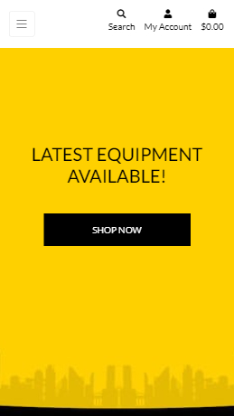
  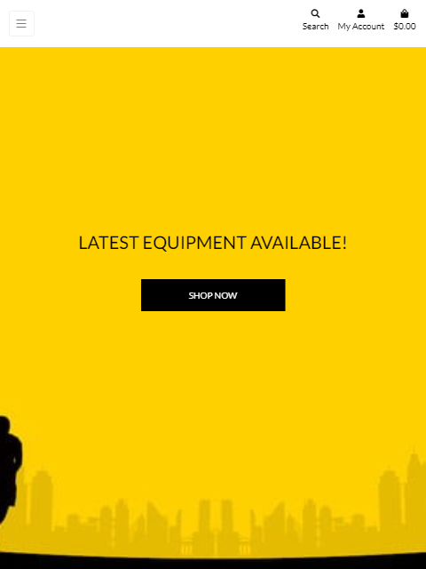

  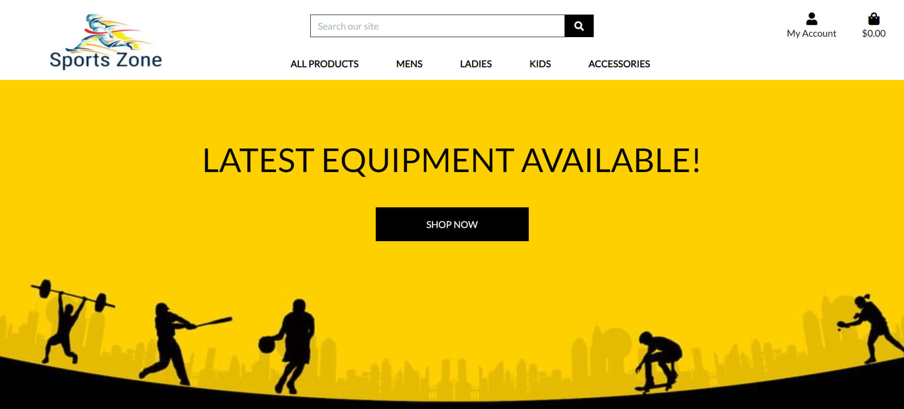

# UX
The ‘Welcome page’ has been designed to make users easily aware of what type of products ‘Sports Zone’ distribute. To achieve this objective, a relevant background has been included to make it clear to all individuals what this website entails. Additionally, a ‘shop now’ button has been placed in the middle of the screen to establish an easily accessible way for the user to browse all products.

Brand awareness is a key feature for ‘Sports Zone’. To obtain this aspiration, the company logo has been placed in the same position throughout the website. This encourages the user to recognise the brand if ever seen elsewhere. 
 
A navigation bar and search bar has been placed on every page of the website. This has been created to provide a simple way for users to browse the website without any complications. Likewise, a shopping bag link and profile link has also been added to every page, to make it apparent to all users.

The ‘shop now’ button displayed on the ‘welcome page’ is designed to convey users to the ‘All Products’ page. This page has all the products listed from both the cricket and football range. All users also have access to this specific page via the navigation bar displayed at the top of each page.
 
Consistency is a key feature throughout the website. To achieve this feature, the navigation bar and logo on the ‘All Products’ page is displayed in the same position as the ‘Welcome Page’. To help give users a visual representation of each product, an image has been advertised alongside the name of the product, price, category and rating. Once selecting the image of each product, the page will be redirected to the selected products detail page. This page will give users a detailed description of the product and an option to select the quantity or (if required) the size of the product they wish to buy. After choosing their required options, the user has an opportunity to add the product to their shopping bag by selecting ‘add to bag’. As the product has been added to the bag, it will be included in the shopping bag aspect that is displayed on the top right of the screen. A pop-up feature will also be displayed to the users indicating the product has been added successfully or if unable to add or any reason, an appropriate message will be dispayed. 
 
The shopping bag link has been established to ensure users can view the products that they are intending to buy alongside the total price and quantity/size of each product. If the user wishes to update the quantity or remove the product from the shopping bag, then there are link options available to do so. To accommodate all individuals buying from ‘sports zone’, there is a total feature within the shopping bag that includes delivery cost.

To complete the purchase, a link at the bottom of the ‘shopping bag’ page is provided named ‘secure checkout’. Once selected, the page will lead the user to a designed check out page where the user will need to add their details, delivery address and payment details. If the user fails to complete a necessary field, the user will not be able to complete the order and will be requested to add the necessary information. 
 
All users are granted access to register and create their account with ‘Sports Zone’. To register or login into an account, the user will need to select the ‘my account’ feature which is displayed on every page on the website. Once an account is created, the user is provided with a profile page that will display personal details and all previous and current purchases with ‘Sports Zone’.
 
If the user is also an admin and logged in as an admin then they will have access to conduct any works that are needed for the website. Those works could be adding new products to the website or changing specific pricing for products.

<a href="#top">Back to top</a>

# User Stories
- ### As a Site User/Customer, I would like to:
    - Understand the range of products available for purchase.
    - Efficiently navigate through the site for browsing purposes.
    - Be able to have different categories to ease my way through the site
    - Be able to specifically search products I am interested in. 
    - View the products listed. 
    - Learn more about the product's specification in detail. 
    - Rearrange the products to have the ones I am interested in towards the top. 
    - View the items and the in shopping bag.
    - Update my basket without having to leave the shopping bag. 
    - View the individual and total cost of all products in the bag, including delivery cost. 
    - Securely checkout to purchase the items required. 
    - Have my details stored for future orders.
    - View the history of the products, I have purchased previously. 
    - Be able to log in and out of the site. 

- ### As an admin, I would like to:
    - Have access to add products with full details.
    - Have access to updated products where needed. 
    - Update images if required. 
    - Have access to remove products or users if needed. 

- ### To achieve the above targets, I have added:
    - A Landing Page and Logo determining the meaning and purpose of the site. 
    - A Navigation bar using bootstrap to guide the user through the site. 
    - Various categories so the user can be lead in the right direction efficiently.
    - A search bar for the user to explore a specific product in mind.
    - Products page, where the user can view all the project in a selected category.
    - Product detail page, where the user can find the product information. 
    - Select Menu for the user to select the order they would like to arrange the list in. 
    - Shopping bag, where the user can add products ready to be purchased. 
    - Cost section, where the user can view the total cost, sub-total for a specific product and delivery cost if required. 
    - Secure Checkout page, where the user can add their details securely to checkout and purchase the products. 
    - Profile page, where the details are saved for the user for future purchases.
    - Profile page, where the user can check their order history. 
    - Dropdown menu with options to log in if not already and log out once logged in. 
    - Added product management in the dropdown menu for admin to add new products. 
    - Added edit and remove buttons for the admin to update details or remove the product. 
    - Added an upload images function in the update and add products section. 

<a href="#top">Back to top</a>

# Database
Data Structure was pre-planned for this project, so the categories can be stored including the products linked to individual categories and all the product details. Besides this the user profile details will be stored including the orders they have made: 

Database

  

‘Sports Zone' has been created to sell a range of sporting products for Men, Women, Kids and Accessories for all. To distinguish each category, the website has clear-headed sections for users to browse. Each category has sub-categories for the two specific sports fields that ‘Sports Zone’ specialises in, Football and Cricket. As one of the main objectives of this website is simplicity, the sub-categories have also been divided into two separate sections, clothing and equipment. All categories consist of storage for the ID, name and friendly name.
 
The products have been allocated to their specific fields on the website. The stored data for each product consist of ID, SKU, name, description, category, size, price, image URL and image.
 
Once a product has been added to the online shopping bag, an order line is generated. The product details that are accumulated from the storage are order, product, product size, quantity and total.
 
 
A profile page has been created to allow users to store their details to create ease for future purchases. The personal details that are stored on this page are user ID, user, full name, full address and telephone number. If required, the detail can also be amended by the user.
 
The order history is available on each user's profile page. The information stored is; the order number, order date, order items, full name, phone number, full address, order total, delivery cost and the total. This data will also be applicable on the confirmation page once an order is completed. 

<a href="#top">Back to top</a>

# Wireframes

- Wireframes were made at the start of the project to create a specific framework for this website. 
### **Wireframe Screenshots:**

Home Page Wireframe

  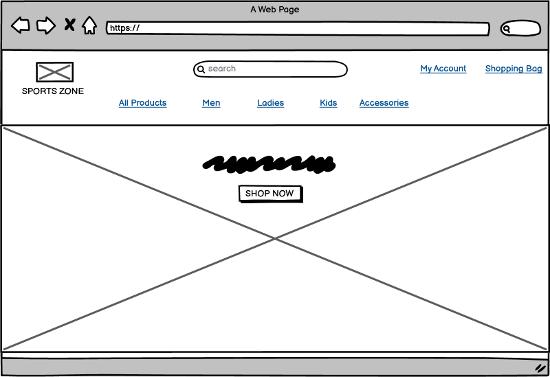

Prodcuts Page Wireframe

  

Product Details Page Wireframe

  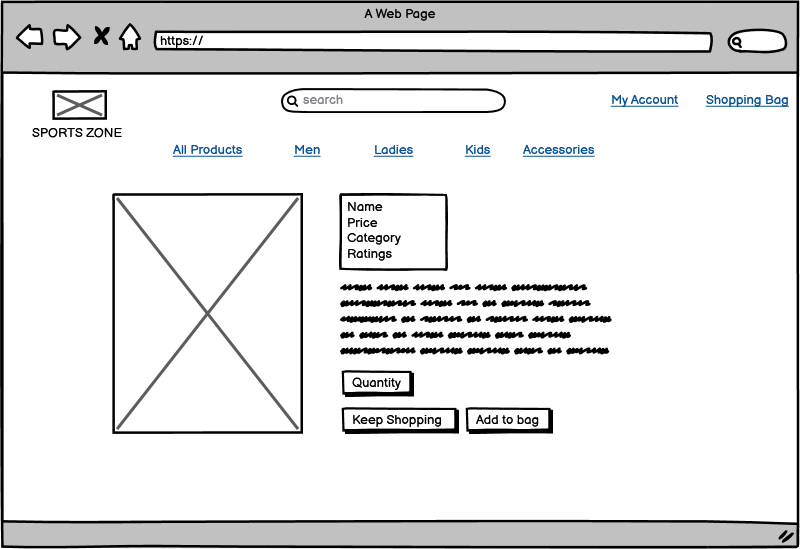

Product Management Wireframe

  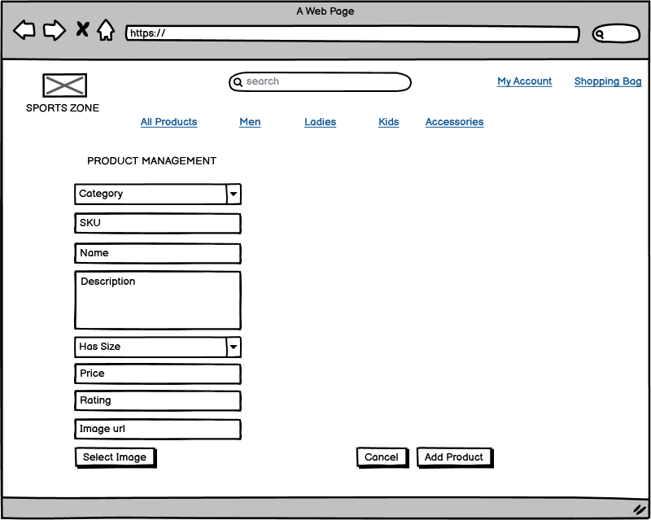

Profile Page Wireframe

  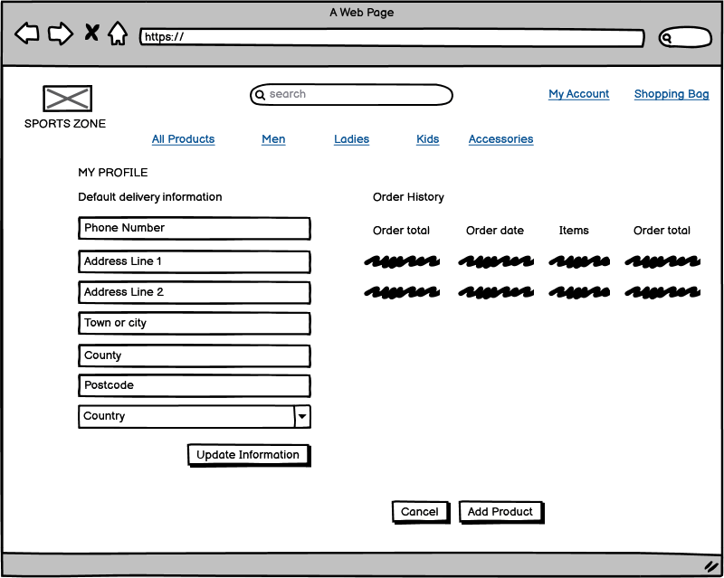

Shopping Bag Page Wireframe

  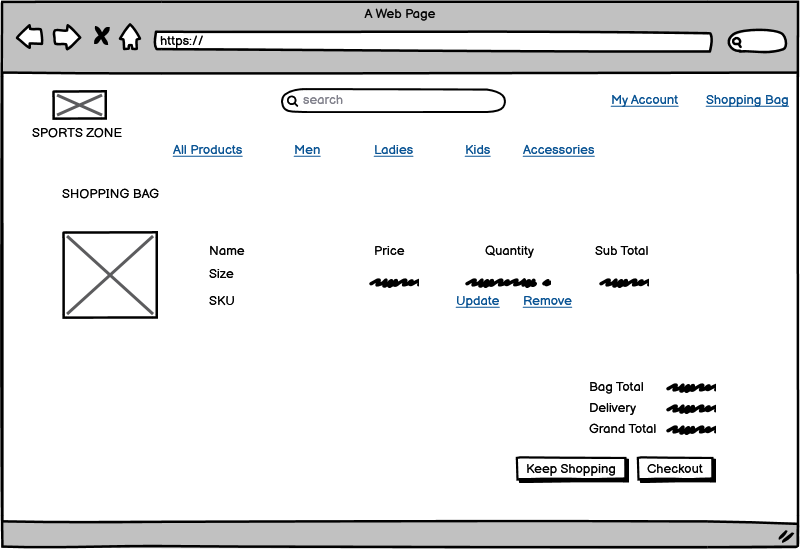

Checkout Page Wireframe

  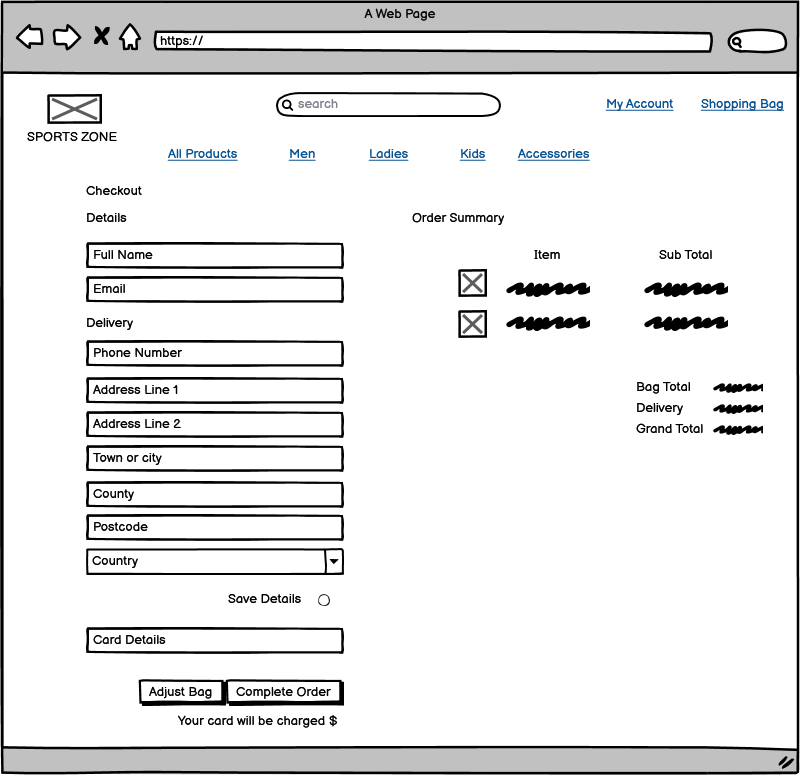

Order Confirmation Page Wireframe

  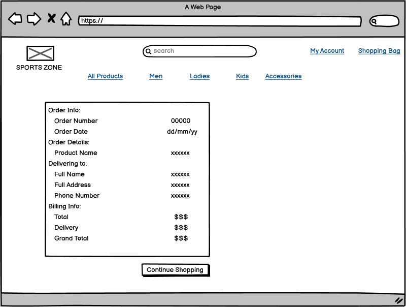

Register Page Wireframe

  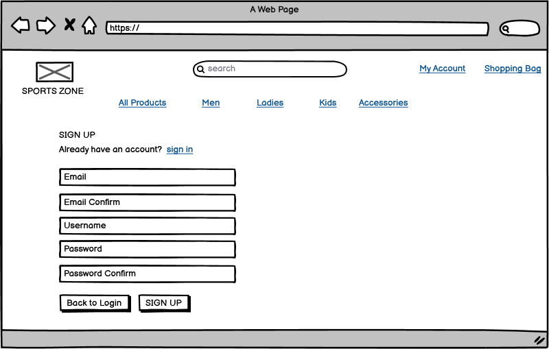

Sign In Page Wireframe

  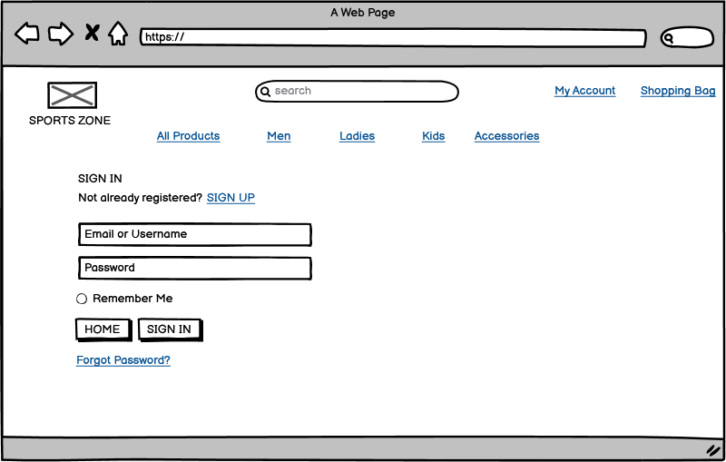

<a href="#top">Back to top</a>

# Views and Features

# Deployment
### Local Deployment
To deploy the project on Github, I created a repository called "sports-zone" and included the Code Institute template.
As I was using gitpod, throughout the project journey, I updated the variables in Gitpod Settings such as:
  - SECRET_KEY = "YOUR_DJANGO_SECRET_KEY"
  - STRIPE_PUBLIC_KEY = "YOUR_STRIPE_PUBLIC_KEY"
  - STRIPE_SECRET_KEY = "YOUR_STRIPE_SECRET_KEY"
  - STRIPE_WH_SECRET = "YOUR_STRIPE_WEBHOOK_SECRET"
  - DEVELOPMENT = "True"

To help acheive the target of this website there were various packages installed through out the project:
  - Django 
  - Django AllAuth 
  - Pillow 
  - Django Crispy Forms
  - Stripe
  - Django Countries
  - DJ Database URL
  - Psycopg2
  - Gunicorn
  - Boto3
  - Django Storages
Every time an installation was done, it was stored in a requirements.txt file. 

To start the project with Django, the django-admin startproject was used which created many useful apps for this project. 

When the changes were made for updating purpose in the project, the migrations were done using the following steps:
  - python3 manage.py makemigrations --dry-run
  - python3 manage.py makemigrations
  - python3 manage.py migrate --plan
  - python3 manage.py migrate

To load the data created in JSON files following commands were used: 
  - python3 manage.py loaddata products
  - python3 manage.py loaddata categories

Django has a built-in admin feature to authorise superusers to log in amend the products by updating, adding or removing them and to achieve this I used:
  - python3 manage.py createsuperuser

In this project, I also used a system known as Amazon S3 Bucket, where I created a bucked named 'sports-zone'. Once the bucket was created I enabled it for public access and enable the website to host static files. Following the steps from Boutique Ado Mini Project, I also added the CORD config. To create the bucket I selected an S3 policy which then provided me with an ARN number. 
Once Bucket was set up I created a user in IAM. To run this successfully I attached a pre-built policy named amazonS3FullAccess. Once created, I attached this policy to the group created. 
Once the group was created I added User to hold the static files granting it programmatic access. Once all done, I was provided with the Access Key ID and Secret Access Key. Which were then added to Heroku Variables. 

Once the S3 bucket was created, I connected Django to the bucket and to achieve that boto3 and Django storages were installed. After this, the variables were added to the settings file so they can only be called when the value is True in the Heroku environment. 
AWS_STORAGE_BUCKET_NAME
AWS_S3_REGION_NAME
AWS_S3_CUSTOM_DOMAIN

### Deploying to Heroku 
To deploy this project to Heroku procedure explained below was followed: 
  - To begin with, an app called 'sports-zone-manny' was created on Heroku.
  - Via "heroku login -i" in the command line I logged in to Heroku.  
  - To use Postgres I installed "dj_database_url" and "psycopg2-binary" ensuring Heroku will install all the app requirements when deployed.
  - In the settings file I added the database URL from Heroku, which can be found in the config variables in-app settings tab.  
  - Once this was achieved I ran migrations and loaded the categories and products. 
  - Then I took out the database URL to stop it from getting added to the version control.
  - Back in the Gitpod workspace I installed gunicorn using pip3 install method.
  - Then a Procfile was creating a web dyno allowing to run unicorn and serve the Django app. 
  - Once achieved, the static file collection was disabled so that Heroku didn't collect the static files when deploying. 
  - Within the settings file, I added 'sports-zone-manny.herokuapp.com' to the list of ALLOWED_HOSTS.
  - Once all these changes were committed, I then pushed them to both GitHub and Heroku master branch.
  - On the deploy screen, select GitHub in the deployment section and select your app from the options of your GitHub repositories.
  - Within settings sections create config vars, these are the same as environment variables Gitpod environment. These are used here as they cant be found on the GitHub page so will need to be set up on Heroku to get the application working.
  - Automatic Deployment will need to be enabled on the settings page so that Heroku runs the most recent update

<a href="#top">Back to top</a>

# Testing
All the code for this website was validated:
- HTML Validation Tested through [W3C](https://validator.w3.org/#validate_by_uri)
- CSS Validation tested throught [W3C CSS](https://jigsaw.w3.org/css-validator/validator)
- Python Validation Tested through [PEP8](http://pep8online.com/) 

### Navigation 
 - Navigation contains five dropdown links, all working fine including the links within each dropdown menu. 
 - Search Bar functionality has been tested and brings up relevant items searched for. 
 - Account icon included in the navigation drops down links including Register, log in if the user isn't logged in.
 - If the user is logged in, the dropdown menu shows the Profile link and logout. 
 - If the user is logged in as admin the drop-down menu also shows the product management link. 
 - Shopping bag updated accordingly with the price when a product is added to the shopping bag. 
 - All these functions have been tested on smaller devices as well where the menu is collapsed. 

### Home Page
- Home page consists of a Hero image which including a Message with a 'Shop Now' button. 
- Button leads you on the all products page as expected. 
- Testing on smaller devices works well including the message being kept in the middle of the screen. 

### Products Page
- Products Page consists of all the product images and correct information with each item listed. 
- Number of items are displayed correctly on the page. 
- Back to top button is working correctly to ease the user to the top of the page.
- Sort by functionality has been tested and it arranges the items accordingly as per the user's request. 

### Product Details Page
- Product Detail page contains an image of the product with a description and other relative information. 
- Sizes choice only visible for relevant products and works fine if the user needs to select a size. 
- Quantity is being changed upon request. 
- If logged in as admin, the Edit button helps edit the product detail and the delete button removes the product. 
- Keep Shopping button leads the user to the expected page.
- Add to bag button adds the product in the shopping bag with an updated total and. 

### Product Management Page
- All the fields ask for relevant information as expected and dropdown fields show the right options. 
- Select image button allows the admin to add a relevant image for the product being added. 
- Cancel button cancels the submission and leads the user to the products page. 
- Add button adds the product and leads the user to the product details. 

### Profile Page
- All the fields requesting appropriate details. 
- Updated information button updates the user details accordingly. 
- Order history visible if previous order has been made. 
- Clicking on the order number leads the user onto order details. 

### Shopping Bag Page 
- An image is visible on the left side with the name, size, SKU and price of the product. 
- Quantity section added and works as intended for the user to update the quantity. 
- Where the update button changes the quantity, the remove button is also added to delete the product from the shopping bag. 
- Item's subtotal is visible for the user. 
- At the bottom of the page, the Bag total, delivery cost and the total is given and is calculated correctly. 
- Keep Shopping button leads the user back to the products page. 
- Checkout button guides the user to the checkout page. 

### Checkout page and Payments
- The checkout page loads with the correct details. 
- The for provided is pre-filled if the user has saved the details on the profile page.
- The items listed for purchase are displayed with appropriate information. 
- If selected, the Check box saves the information in the form.
- Adjust bag button leads the user back to the shopping bag. 
- If all the details are correct, Complete the order runs the order and takes the payment via stripe.
- If any required information is missing or incorrect details provided, a message is given accordingly with the cancellation reason.
- Stripe payment works as expected, including the webhooks.

### Toasts
- The users are provided with a message in the top right corner every time an amendment is made. Such as if the user adds into the shopping bag, removes an item, updates any details, an appropriate message is shown. 
- All the scenarios have been tested and working as expected. 
- Toasts are coming up with an image and other product details. 
- Delivery details are also shown in the toasts. 

# Bug(s) and Resolution(s): 
Bugs are a huge contribution towards learning, same in this profession every bug occurs, teaches you a lesson on how you may face problems and ways to find those solutions to overcome these problems. I faced a few problems during this journey listed as following including their resolution source:
- First of all, the clothing items were set to have a size selection for the user, but all the items are set to have no sizes by default. Some of the products and categories were added (through JSON file) after adding this function therefore when loading the data everything was being set to have no sizes. To resolve this issue I finished the categories and products in JSON file first then added this functionality. 
- Another bug faced was the shopping bag details, as they were not coming up correct. To resolve this I had to make changes in contect.py where "quantity=item_data" was updated to "quantity=quantity" which then brought up the correct details. 
- Another bug faced was with the webhook, where 301 error was received on stripe. Every time a test webhook was being sent 301 error was received. As known in coding, most little mistakes can cause long delays. The resolution for this issue was just to add "/" at the end of the endpoint link added in stripe.
- One unresolved bug for this project is the confirmation success page can be accessed by other users. Adding in required_login decorater meant unregistered users not being able to checkout successfully. This is something I will be working to find the right solution. 

# Technologies and Tools Used
- [HTML5](https://en.wikipedia.org/wiki/HTML5)
- [CSS3](https://en.wikipedia.org/wiki/CSS)
- [JavaScript](https://en.wikipedia.org/wiki/JQuery) / [JQuery](https://en.wikipedia.org/wiki/JavaScript)
- [Python](https://en.wikipedia.org/wiki/Python_(programming_language))
- [Django](https://www.djangoproject.com/)
- [Bootstrap4](https://getbootstrap.com/) was used to organise the content in a grid format. 
- [Balsmiq](https://balsamiq.com/) was used to create the wireframes.
- [Google Font](https://fonts.google.com/)  was used all through the website for font.
- [Font Awesome](https://fontawesome.com/) was used for the icons used for the website. 
- [TinyPNG](https://tinypng.com/) was used to compress the images without making any changes to the size. 
- [Heroku](https://dashboard.heroku.com/apps) / [GitHub](https://github.com/) for deployment. 
- [AWS](https://aws.amazon.com/) for storing static files. 
- [Stripe](https://dashboard.stripe.com/test/dashboard) for payments and webhooks. 
- [Boutique Ado Mini Project](https://github.com/Code-Institute-Solutions/boutique_ado_v1/tree/250e2c2b8e43cccb56b4721cd8a8bd4de6686546) for guiding me through the whole project with detailed information on anything needed for this project. 

<a href="#top">Back to top</a>

# Acknowledgements
I would like to thank code institute for an amazing opportunity to learn and develop my skills in the web development field. I appreciate all the help and support provided through the modules, tutor assistance and many other ways of assistance. Felipe, my mentor, has once again been a great help for guiding me to the correct path, supporting me at every step of this journey and for rescuing me from any unwanted situation. Additional help provided by my mentor through mentor sessions weekly built my confidence, morale and knowledge up to achieve this goal. I would like to thank all the tutors from tutor support, who helped me resolve the issues I had by guiding me towards the solution. Also, technologies I have used, such as Boutique Ado Project and Slack to help me achieve the final version of this site.

<a href="#top">Back to top</a>

